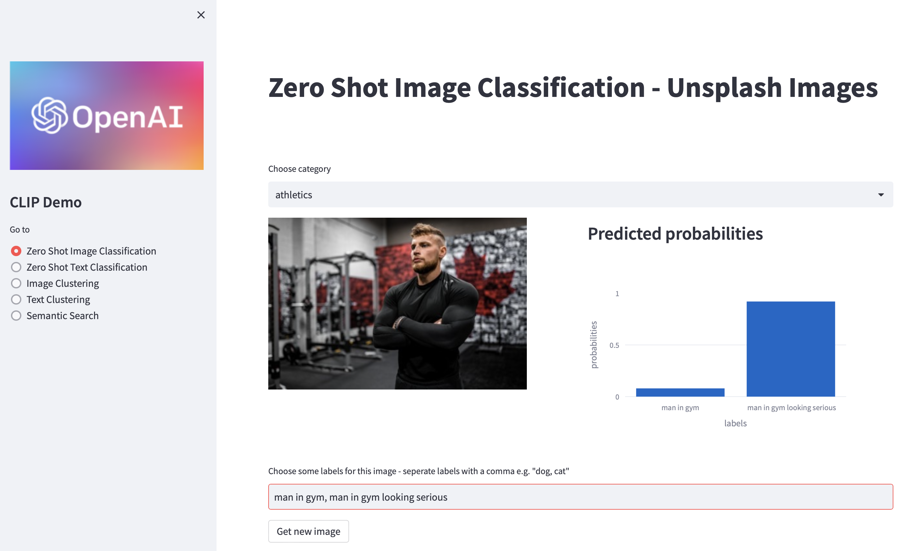
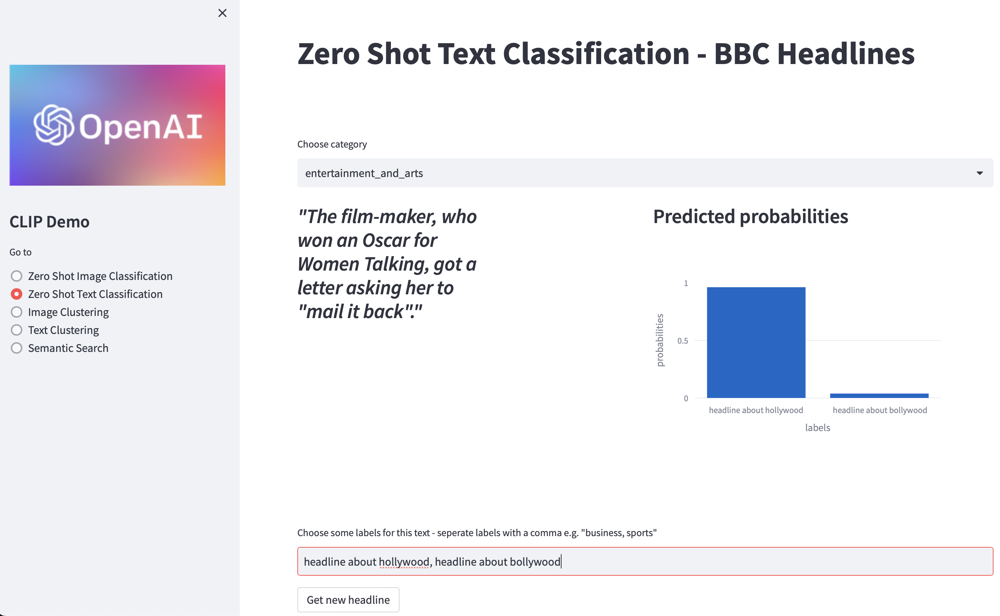
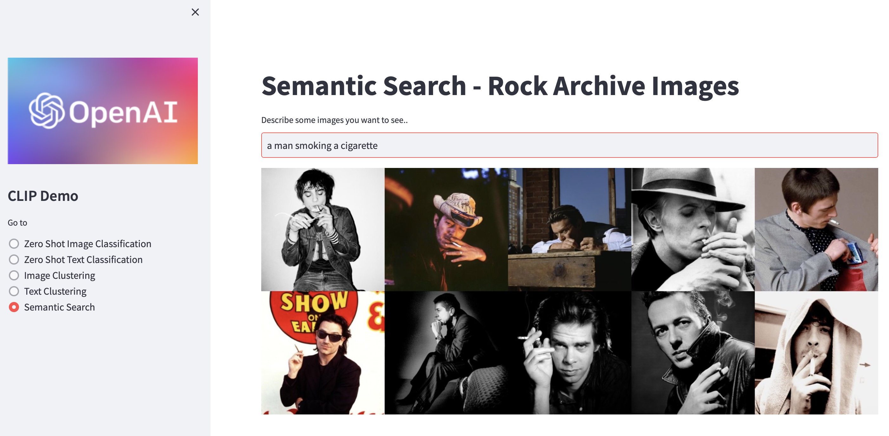

# CLIP Demo

This repository contains a streamlit application that demonstrates how to use OpenAI's CLIP model for a variety of natural language and computer vision tasks such as zero-shot classification, image clustering, text clustering, and semantic search.

---

## Installation
Clone this repository 

`git clone https://github.com/OpenAI-APAC/CLIP-Demo`

Install the required packages 

```pip install -r requirements.txt```

---

## Use

Navigate to the cloned directory and launch the Streamlit app with 

`streamlit run clip_app.py`

Use the sidebar navigation menu to choose the task that you would like to explore.

---

## App Overview

This demo application provides several different sub-apps that allow you to explore the capabilities of OpenAI's CLIP model. 
These sub-apps include:

### Zero Shot Image Classification - Unsplash Images
This streamlit app allows users to classify images from the Unsplash website using the OpenAI CLIP model. 
The app presents a random image from unsplash and the user can then enter one or more labels that they think describe the image, and the app will use the 
CLIP model to generate a list of probabilities for each of the labels.



### Zero Shot Text Classification - BBC Headlines

This Streamlit app performs text classification on news headlines scraped from the BBC news website. 
It uses the OpenAI CLIP model to classify the headlines into user-specified labels. The app displays a random 
headline from a category selected by the user, and the user can input labels for the headline. The app then uses 
CLIP to classify the headline into those labels, and displays the predicted probabilities for each label. 
The user can then request a new headline to classify. 





### Image Clustering

The app uses CLIP to generate image embeddings the UMAP algorithm for 
dimensionality reduction to visualize the clustering of images. The user can input a URL to an image 
and the app will calculate its embedding and include it in the clustering. The resulting clusters are displayed as 
a scatter plot where each point represents an image, and similar images are grouped together. 
The app can be used to analyze collections of images and identify patterns or clusters within them.

### Text Clustering

This Streamlit app is a text clustering tool that allows the user to input a short caption and see it visualized 
alongside a pre-existing dataset of text embeddings. The tool uses the UMAP algorithm to reduce the dimensionality 
of the embeddings and then plots the resulting 2D space with Plotly. The user's input is added to the dataset and 
can be distinguished from the pre-existing data with different colors and sizes.

### Semantic Search

This Streamlit app allows the user to perform semantic search of images using natural language queries. 
It uses the CLIP (Contrastive Language-Image Pre-Training) model to encode both the images and the natural 
language queries into embeddings, and then uses cosine similarity to rank the similarity between the query and a 
list of cached image embeddings. The app allows the user to input a natural language query and displays a grid of 
images that are most similar to the query, based on their embeddings.



## Cached Data
Note that some of these sub-apps require pre-cached embeddings of the relevant data. These are available in the /data directory of this repository.

### Images

Around 1250 images were scraped from https://www.rockarchive.com/ and their CLIP embeddings were generated locally. 
The resulting embeddings were then persisted to a Pandas DataFrame and cached locally for future use.

### Captions

To create captions for the images, https://ai.google.com/research/ConceptualCaptions/ was used. The captions' CLIP 
embeddings were also generated locally and pickled in a Pandas DataFrame, which was then cached locally.